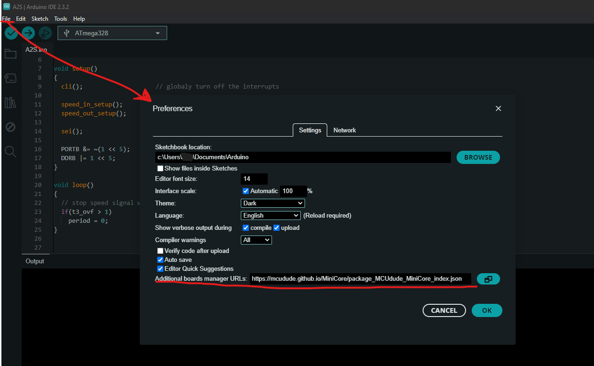
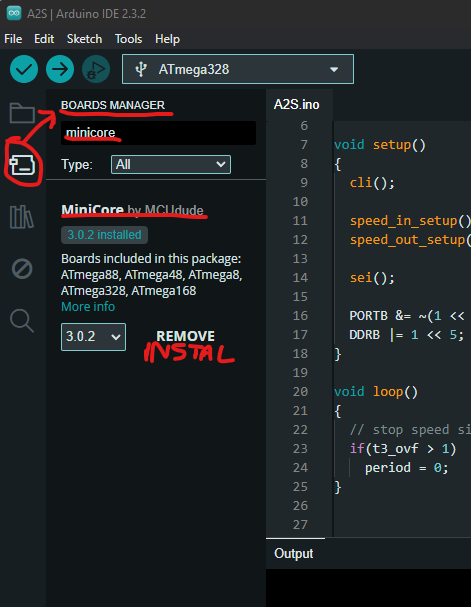
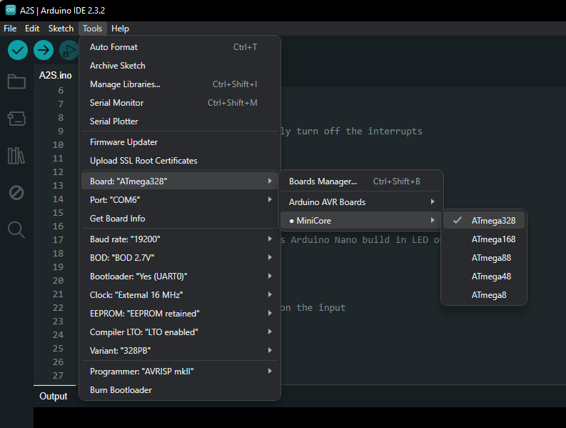
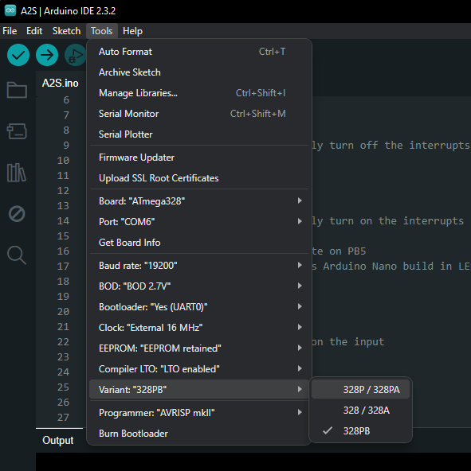

# ABS2SPEED Arduino SW
## History
- v0.5 2024.10.10 - small corrections for glitches when VSS is disconnected (abnormal situation), probably a bit safer also for very low speeds / 0km/h; small correction for staging feature.
## Compilation
Arduino IDE does not provide an option for just uploading the SW to the board. The "Upload" option always compiles the program before uploading it. Therefore even if you don't need to modify any parameters in the program you still have to be able to compile it. Well, unless you know your way around AVR microcontrollers well enough to think that you could programm hex file outside of Arduino IDE... but it also means the following instructions are not a problem for you ;-)

By default Arduino IDE does not include the Nano V3 board based on ATMega328PB which is crucial for this project - ATMega328P won't work! Since the PB version includes additional HW and registers used in this project you will need to add new board such as MiniCore to the IDE. More details on MiniCore can be found here: https://github.com/MCUdude/MiniCore?tab=readme-ov-file#boards-manager-installation
1. Go to "File->Preferences" and in the field "Additional boards manager URLs" add the following address: https://mcudude.github.io/MiniCore/package_MCUdude_MiniCore_index.json
   
2. Go to Boards Manager (on the side panel or in "Tools" menu), search for "minicore" and install it:
   
3. Go to "Tools" menu and set the board as follows:
   
   
   
You should now be able to compile the program but not yet to upload it.

## Upload
MiniCore boards use a different bootloader than the stabdard Arduino Nano. However, most Nano V3 boards based on ATMega328PB on the market will have a standard Nano bootloader and will be recognized in Arduino as ATMega328P. Since Arduino IDE doesn't allow to compile the program with setting it for one board and then just upload it using a different setting this poses a problem.

**IMPORTANT** The following instruction assume that your Nano has a standard bootloader. You can confirm it by compiling and uploading simple "Blink" example from Arduino IDE to your board. Just set your IDE to standard Nano board, go to "File->Examples->01.Basics->Blink" and then "Sketch->Upload". If your board has a non standard botloader and this process fails then it's out of the scope of this document.

There are few ways to go around the above problem but this one seems to me like the easiest:
1. Go to the following path on your PC: "C:\Users\"HERE YOUR USER NAME"\AppData\Local\Arduino15\packages\MiniCore\hardware\avr\3.0.2". The path may differ if your Arduino IDE is installed in a non standard way or your MiniCore library is of different version (different numbers in the name of the last folder in this path).
2. Change the "platform.txt" file to the one provided here.
3. If you had Arduino IDE opened restart it.

This will change the way IDE is programming the board to the standard botloader even though you have the MiniCore board chosen. You should now be able to upload the program.

